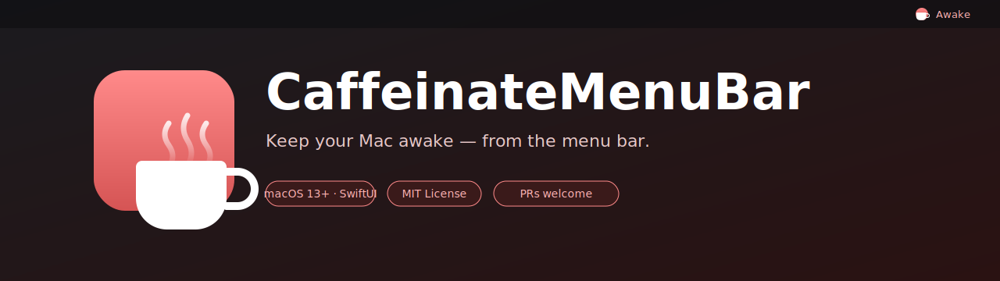
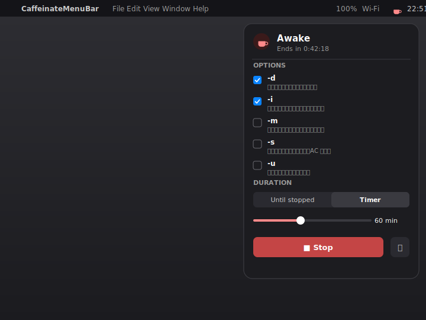

<p align="center">
  
</p>

<h1 align="center">CaffeinateMenuBar</h1>

<p align="center">
  <strong>Mac をスリープさせない —— メニューバーから。</strong><br/>
  macOS 標準の <code>caffeinate(8)</code> を SwiftUI でラップした小さなネイティブアプリ。
</p>

<p align="center">
  
  
  
  
  
  <a href="https://github.com/akidon0000/caffeinate-menubar/actions/workflows/ci.yml"></a>
</p>

<p align="center">
  <a href="README.md">English</a> ·
  <a href="README.ja.md">日本語</a>
</p>

---

<p align="center">
  
</p>

## ✨ どうして作ったの？

`caffeinate` は長時間ビルド・レンダリング・ダウンロード中に Mac を起こしておくためのちょうど良いツールですが、毎回ターミナルでフラグを叩くのは面倒で、しかもターミナルを開いたままにしておく必要があります。**CaffeinateMenuBar** はその上に最小限の GUI を被せたものです。メニューバーに常駐して、クリックして、欲しいフラグにチェックを入れて、タイマー（または無期限）を選んで **Start**。それだけ。

`caffeinate` が動いている間は、メニューバーのアイコンが**薄い赤色**に変わるので、Mac が起こされ続けていることが一目で分かります。

## 🚀 特長

- 🍵 **メニューバー常駐** — Dock アイコンなし、ウィンドウも開かない（`LSUIElement = YES`）。
- 🔴 **状態が一目で分かる** — 動作中はカップアイコンが薄い赤色に。
- ☑️ **すべてのフラグをマウスで**: `-d` `-i` `-m` `-s` `-u`、それぞれに日本語の短い説明付き。
- ⏱ **タイマー / 無期限** — 5〜480 分のスライダーで `-t <秒>` に変換。
- 💾 **設定を記憶** — `@AppStorage` で永続化。
- 🧹 **きれいなプロセス管理** — Stop / タイマー終了 / アプリ終了で子プロセスを必ず終了。

## 🧰 動作環境

- macOS **13.0** Ventura 以降（SwiftUI `MenuBarExtra` を使用）
- Xcode **15 以降**（macOS SDK 同梱）
- 任意: [XcodeGen](https://github.com/yonaskolb/XcodeGen)（`project.yml` から `.xcodeproj` を再生成する場合）

## 📦 インストール

### 方法 1: ソースからビルド（推奨）

```bash
git clone https://github.com/akidon0000/caffeinate-menubar.git
cd caffeinate-menubar

# Xcode プロジェクトの生成（.xcodeproj が無いか、project.yml を編集した場合のみ）
xcodegen generate

# Release ビルド（アドホック署名）
xcodebuild -project CaffeinateMenuBar.xcodeproj \
  -scheme CaffeinateMenuBar -configuration Release \
  -derivedDataPath build \
  CODE_SIGN_IDENTITY=- CODE_SIGNING_REQUIRED=NO CODE_SIGNING_ALLOWED=NO \
  build

# /Applications にコピーして起動
cp -R build/Build/Products/Release/CaffeinateMenuBar.app /Applications/
open /Applications/CaffeinateMenuBar.app
```

### 方法 2: Xcode で開く

```bash
open CaffeinateMenuBar.xcodeproj
```

**⌘R** で実行。

> [!NOTE]
> ビルドは **アドホック署名**（`CODE_SIGN_IDENTITY=-`）です。`/usr/bin/caffeinate` を `Process.run` する都合で App Sandbox とは併用できません。Signing & Capabilities で App Sandbox を有効化しないでください。

## 🖱 使い方

1. メニューバーのカップアイコンをクリック。
2. 使いたい `caffeinate` のフラグをチェック。
3. **Until stopped**（手動停止まで）か **Timer**（スライダーで分数を選択）を選ぶ。
4. **Start** を押すと、アイコンが薄い赤に変わり、ヘッダーに残り時間が表示されます。
5. もう一度クリックして **Stop**、または ⏻ ボタンでアプリ自体を終了。

### フラグ早見表

| Flag | 効果 |
| --- | --- |
| `-d` | ディスプレイのスリープを防ぐ（画面を点けっぱなしにする） |
| `-i` | システムのアイドルスリープを防ぐ |
| `-m` | ディスクのアイドルスリープを防ぐ |
| `-s` | システムスリープを防ぐ — **AC 電源接続中のみ有効** |
| `-u` | ユーザーが操作中であると宣言する（既定で 5 秒間） |

詳しくは `man caffeinate` を参照してください。

## 🏗 アーキテクチャ

```
CaffeinateMenuBar/
├── CaffeinateMenuBarApp.swift   # @main、MenuBarExtra ラベル + アイコン着色
├── CaffeinateController.swift   # 子プロセスを管理する ObservableObject
└── ContentView.swift            # ポップオーバー UI（トグル / スライダー / Start/Stop）
```

- `CaffeinateController` が `Foundation.Process` 経由で `/usr/bin/caffeinate` を起動・終了監視し、`Timer` でタイマー終了時に自動停止します。
- 設定は `@AppStorage`（`flag.d`, `flag.i`, …, `duration.mode`, `duration.minutes`）で永続化されます。

## 🤝 コントリビュート

歓迎します！小さな個人プロジェクトですが、みんなにとって良くなる PR は大歓迎です。

手を入れやすそうな場所:

- 🌐 翻訳の追加（英語と日本語があるので、他の言語があると嬉しい）
- 🎨 ちゃんとした `.icns` アプリアイコン（今は SVG ロゴしか無い）
- 🔋 バッテリー状態の表示（`-s` をバッテリー時にグレーアウトする等）
- 🧪 `CaffeinateController` のユニットテスト（プロセスのライフサイクル / タイマー）
- 🧷 ログイン時起動トグル（`SMAppService`）
- 📦 Homebrew Cask の formula

### 流れ

1. Fork してブランチを切る（`feat/...` または `fix/...`）。
2. 1 PR 1 トピックで、コミットメッセージは短く分かりやすく。理由が非自明なら本文で補足。
3. ビルドが通ることを確認: `xcodebuild ... build`（インストール手順を参照）。
4. PR を作成。UI 変更ならスクリーンショット／GIF があると嬉しい。
5. レビューはお互いに優しく 🙂

詳しくは [CONTRIBUTING.md](CONTRIBUTING.md) を参照してください。

## 🤖 CI / リリース

| Workflow | トリガー | 内容 |
| --- | --- | --- |
| [`ci.yml`](.github/workflows/ci.yml) | PR / `main` への push | Release ビルド（アドホック署名）と `.app` のアーティファクト保存 |
| [`release-app-store.yml`](.github/workflows/release-app-store.yml) | タグ `v*` | `fastlane mac release` を実行（署名 → アーカイブ → `.pkg` エクスポート → App Store Connect API アップロード） |
| [`xcode-version.yml`](.github/workflows/xcode-version.yml) | 週次 cron | ランナーに新しい Xcode が来たら Issue を自動起票 |

リリースは **fastlane** ([`fastlane/Fastfile`](fastlane/Fastfile)) で実行します。ローカルでも CI と同じ env で `bundle exec fastlane mac release` を回せます。Dependabot で GitHub Actions と Bundler（fastlane）の両方を週次・グループ化でアップデートします。シークレットや証明書の初回セットアップ、タグ駆動のリリース手順は **[docs/release.md](docs/release.md)** を参照してください。

## 📜 ライセンス

[MIT](LICENSE) © akidon0000

## 🙏 謝辞

- Apple 標準の [`caffeinate(8)`](x-man-page://caffeinate) —— このプロジェクトは単にその親しみやすい UI を被せただけです。
- Caffeine / Amphetamine / KeepingYouAwake などの先輩 Mac ユーティリティに着想を得ました。
